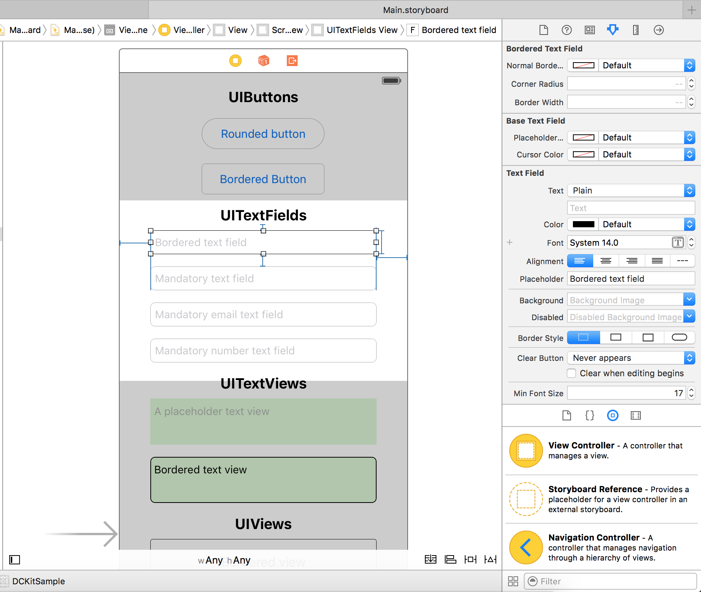
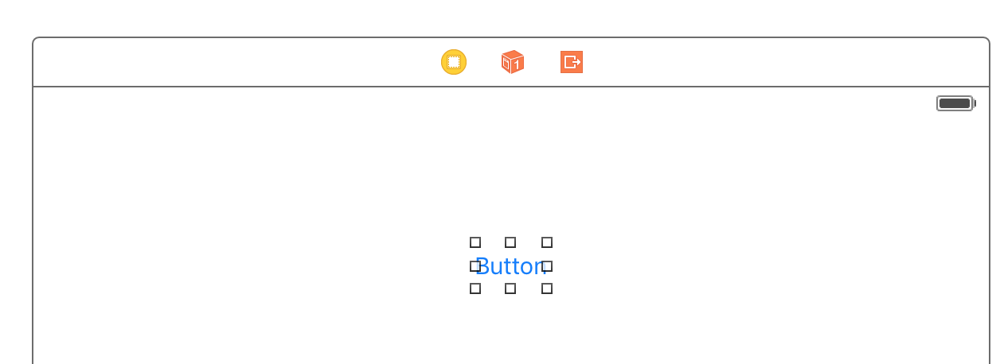
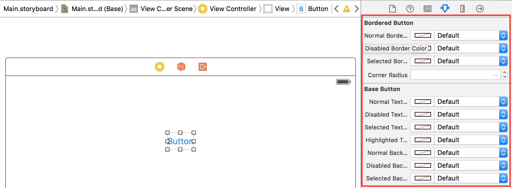

# DCKit

DCKit is a set of *@IBDesignable* iOS controls (`UIButtons`, `UITextFields` etc.), which have useful *@IBInspectable* properties. They allows you to build a nice screens, see a result directly on Xcode Interface Builder.

Written on Swift.

##Preview

## Installation

### Cocoapods

[CocoaPods](http://www.cocoapods.org) recommended to use DCKit.

1. Add `pod` record to your *Podfile:*
  * **Swift 3**: `pod 'DCKit', :git => 'https://github.com/agordeev/DCKit.git'`
  * **Swift 2.3**: `pod 'DCKit', :git => 'https://github.com/agordeev/DCKit.git', :branch => 'swift23'`
  * **Swift 2.2** and below: `pod 'DCKit', '<= 1.0.4'`
2. Add `use_frameworks!` keyword to your *Podfile*. The library is written on Swift, so this is a mandatory.
3. Install the pod(s) by running `pod install`.

### Source files

1. Download the [latest code version](https://github.com/agordeev/DCKit/archive/master.zip) or add the repository as a git submodule to your git-tracked project.
2. Drag and drop the **Classes** directory from the archive in your project navigator. Make sure to select *Copy items* when asked if you extracted the code archive outside of your project.

## How to use

1. Add a control (e.g. `UIButton`) onto storyboard:

2. Change the button's class to `DCBorderedButton`. Also change module to `DCKit` if you've installed the library via CocoaPods. You'll notice a border appeared around the button:

3. Now you're able to customize the button from IB directly:

Please download the [latest code version](https://github.com/agordeev/DCKit/archive/master.zip) and run `DCKitSample.xcodeproj` to test out all the features it offers.

## Documentation

Basically, all of the classes are pretty straightforward and don't worth describing. Most of them you can see in the demo project.

I'll describe a few of them here though.

#### DCHairlineView

Very useful control, I widely use it in my projects as a separator between views.

#### DCMandatoryTextField

Base text field for all the mandatory text fields. Highlights the text field if the entered value is false.

By default it considers the empty value as invalid. You can override this behaviour by subclassing this class and overriding `isValid` method.

#### DCMandatoryEmailTextField

This field is also checks if the entered value is a valid email address. It uses a regexp taken from here: http://stackoverflow.com/questions/5428304/email-validation-on-textfield-in-iphone-sdk

## Requirements

* Xcode 6 or above
* iOS 8 or above
* Swift 2.0 and above

## Author

[Andrey Gordeev](http://stackoverflow.com/users/1321917/andrey-gordeev)

## License

This project is under MIT license. For more information, see `LICENSE` file.
